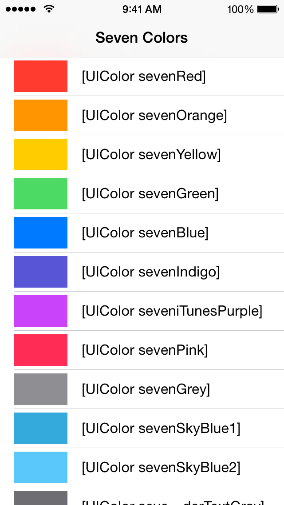

## Seven Colors

Apple's standard iOS 7 colors in a convenient category on `UIColor`.

Simply drag-and-drop `UIColor+SevenColors.h` and `UIColor+SevenColors.m` into your Xcode project.

### Screenshot

</img>

### Colors

	+ (UIColor *)sevenRed;
	+ (UIColor *)sevenOrange;
	+ (UIColor *)sevenYellow;
	+ (UIColor *)sevenGreen;
	+ (UIColor *)sevenBlue;
	+ (UIColor *)sevenIndigo;
	+ (UIColor *)seveniTunesPurple;
	+ (UIColor *)sevenPink;
	+ (UIColor *)sevenGrey;
	+ (UIColor *)sevenSkyBlue1;
	+ (UIColor *)sevenSkyBlue2;
	+ (UIColor *)sevenGroupedTableViewHeaderTextGray;
	+ (UIColor *)sevenGroupedTableSeparatorLineGray;
	+ (UIColor *)sevenSwitchGreen;
	+ (UIColor *)sevenGroupedTableViewBackground;
	+ (UIColor *)sevenNavigationBarBackground;
	+ (UIColor *)sevenGreyedOutTableText;

## License

The MIT License (MIT)
